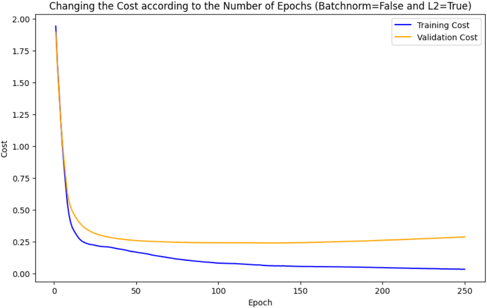

# Neural-Networks-From-Scratch
Constructing a simple neural network "from scratch" to deepen comprehension of the forward and backward propagation processes.

## Table of Contents :clipboard:
  * [Introduction](#Introduction-bookmark_tabs)
  * [Goals](#goals-dart)
  * [Data Description](#data-description-bar_chart)
  * [Experimental Configuration](#experimental-configuration-gear)
  * [Experimental Results](#experimental-results-chart_with_upwards_trend)
  * [Experimental Visualizations](#experimental-visualizations-art)

## Introduction :bookmark_tabs:
This project aims to delve into the core mechanics of neural networks by constructing a simple neural network "from scratch".

Neural networks are powerful tools for machine learning and artificial intelligence, but their inner workings can sometimes seem complex. By building a neural network from scratch, this project offers a unique opportunity to gain a deeper understanding of how these networks function at a fundamental level.

## Goals :dart:
The primary objective is to construct a neural network from scratch to foster a profound comprehension of its underlying processes.

This involves:

- Implementing forward and backward propagation.
- Training the network and generating predictions.
- Utilizing the developed code to classify the 'MNIST' dataset and presenting a comprehensive summary report.
- Integrating batch normalization and L2 normalization into the network architecture.
- Analyzing and comparing performance, runtime, and training steps with and without the inclusion of batch normalization and L2 normalization.

## Data Description :bar_chart:
Network performance and evaluation were done on the 'MNIST' dataset, which is a collection of 28x28 pixel grayscale images of handwritten digits (0 through 9). The dataset contains 60,000 training images and 10,000 test images.

## Experimental Configuration :gear:
Validation set: The training set was split into a 80-20 ratio, with 48,000 samples for training and 12,000 for validation, randomly selected.

-	The network consists of 4 layers (excluding the input layer) with respective sizes: 20, 7, 5, 10.
- Input is flattened to a matrix of dimensions [number of examples, 784] at each iteration.
- Batch size: 128.
- Learning rate: 0.009.
- Maximum epochs: 250.
- Training halts upon no significant improvement observed in the validation set, based on the stopping criterion of 100 training steps.
- Stopping criterion: 0.00001.
- Batch normalization is toggled on/off.
- L2 norm regularization is toggled on/off.

Presented below are the dimensions of weights, biases, and activation values across all layers of the network. Notably, the network's input comprises a batch of 128 samples, each of size 784 (derived from flattened 28x28 images). The network's output yields a matrix of size (10x128), with each of the 128 samples in the batch represented by 10 values corresponding to the 10 potential labels (digits 0-9) for classification.

## Experimental Results :chart_with_upwards_trend:
Outlined below are the results of three experiments conducted with different combinations of batch normalization (on/off) and L2 normalization (on/off):

| Exp. # | Batch Norm | L2 Norm | # of Epoches | # of Iterations | Train Accuracy | Val Accuracy | Test Accuracy | Train Cost | Val Cost | Time (sec) |
|---|---|---|---|---|---|---|---|---|---|---|
| 1 | False | False | 244 | 91,425 | 0.973 | 0.930 | 0.934 | 0.074 | 0.297 | 235 |
| 2 | True | False | 124 | 46,325 | 0.807 | 0.808 | 0.807 | 0.622 | 0.715 | 158 |
| 3 | False | True | 250 | 93,750 | 0.976 | 0.935 | 0.932 | 0.034 | 0.288 | 257 |

## Experimental Visualizations :art:

**Fig. 1** | Experiment 1 with Batch Norm = False, L2 norm = False.

---

**Fig. 2** | Experiment 2 with Batch Norm = True, L2 norm = False.

---

**Fig. 3** | Experiment 3 with Batch Norm = False, L2 norm = True.
